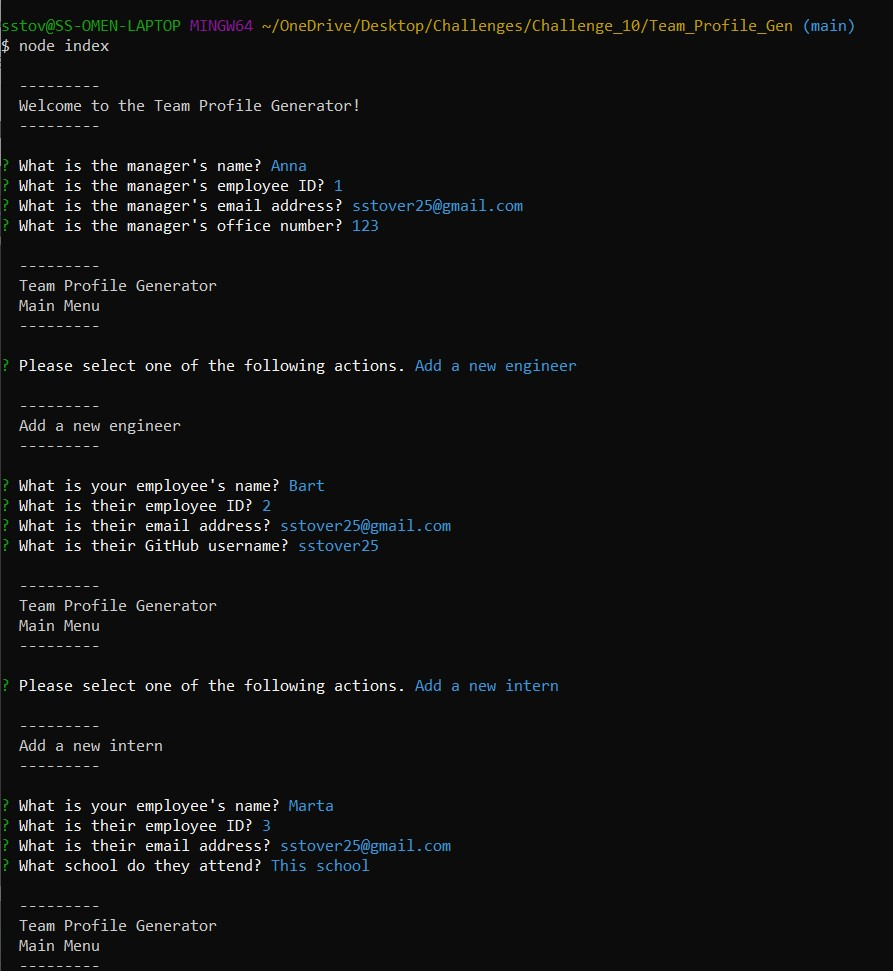
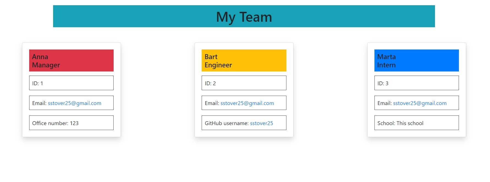

# Object-Oriented Programming Challenge: Team Profile Generator

## Description

```
The client requested an application that could be used to generate unique
team profiles. The application is required to run from the command line
using Node. The application collects various pieces of data about a manager,
engineers, and interns, which is then used to generate an html file that
displays the information in an aesthetically pleasing and easy-to-view way.
```

## User Story

```
AS A manager
I WANT to generate a webpage that displays my team's basic info
SO THAT I have quick access to their emails and GitHub profiles
```

## Acceptance Criteria

```
- It is done when the user is prompted for their team members information,
which then results in an HTML file being generated that displays a nicely
formatted team roster based on user input.


- It is done when the user clicks on an email address in the generated HTML
and their default email program opens and populates the TO field of the
email with the address.


- It is done when the user clicks on an engineer's GitHub username and a
new tab opens up with their GitHub profile.


- It is done when the user starts the application and is prompted to enter
the team manager’s name, employee ID, email address, and office number.


- It is done when, after the user enters the team manager’s name,
employee ID, email address, and office number, they are presented with
a menu with the option to add an engineer or an intern or to finish building
their team.


- It is done when a user select the engineer option and is then prompted to
enter the engineer’s name, ID, email, and GitHub username. After completing
that, the user is taken back to the menu.


- It is done when a user select the intern option and is then prompted to
enter the intern’s name, ID, email, and school. After completing that, the
user is taken back to the menu.
```

## Walkthrough Video

```
https://drive.google.com/file/d/1fPh5NYj0vPHTZLajJnjYDjZw7szIAtTn/view
```

The following images demonstrates the application functionality:

The application in the terminal



The HTML file generated after closing out the application



## Review

You are required to submit the following for review:

- A walkthrough video demonstrating the functionality of the application:
  https://drive.google.com/file/d/1fPh5NYj0vPHTZLajJnjYDjZw7szIAtTn/view

- A sample README.md file for a project repository generated using your application:

- The URL of the GitHub repository: https://github.com/sstover25/Team_Profile_Gen

---

## Installation

```
To use this applicaiton, you must have Node.js installed as well as Inquirer installed.
```

## Credits

```
Coding assistance from KU bootcamp modules, https://developer.mozilla.org/,
w3Schools documentation, Bootstrap documentation, Inquirer documentation, and Stack Overflow.
```

© 2021 Trilogy Education Services, LLC, a 2U, Inc. brand. Confidential and Proprietary. All Rights Reserved.
